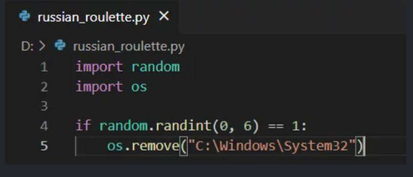

# Postmortem

## Apache is returning a 500 error

### Issue Summary
on friday, 24 mar 2017 at 07:32:16 GMT who tried to access the server the server went down and returned 500 internal server error

### Timeline
- **07:32 GWT** => getting 500 error for who tried to access the server
- **07:40 GWT** => find out error because Apache server
- **07:46 GWT** => running process using strace and run the server using curl
- **07:50 GWT** => after checking what is going on while trying to access the server we found the error was in the php file
- **07:52 GWT** => updated the file and then run the apache server
- **07:53 GWT** => running the server using curl and getting 200 status code
- **07:55 GWT** => the server restarts begin
- **08:00 GWT** => the server now working normally and everything goes well

### Root Cause and resolution
the issue was with a wrong file name in php file that running while running the server using curl the server was .phpp and it have to be .php this error got cause some script running wrong and changed that php file so we just edited this file name and restart the server and then everything goes well

### Corrective and preventative measures
- whatever the server should have errors and we have to find it out and fix it
- we have to testing the server after running any script locally before update it remotely and fix any error we will find out then mesure the server running very well then update everything
